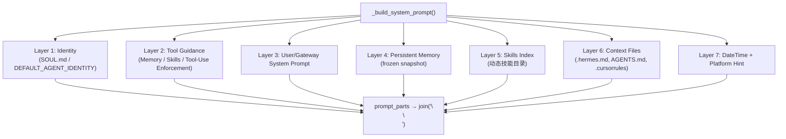
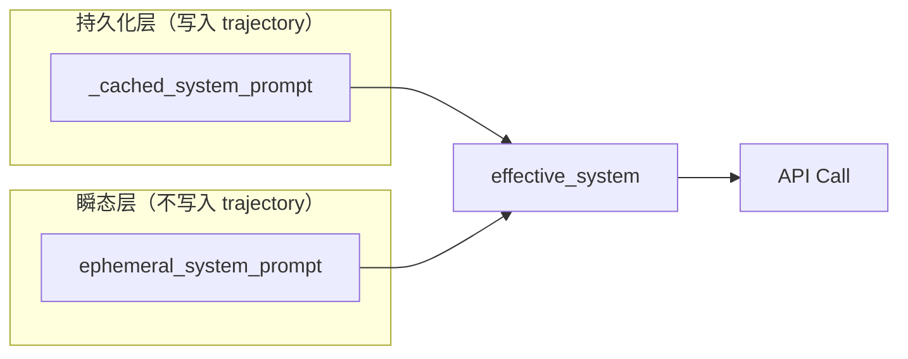
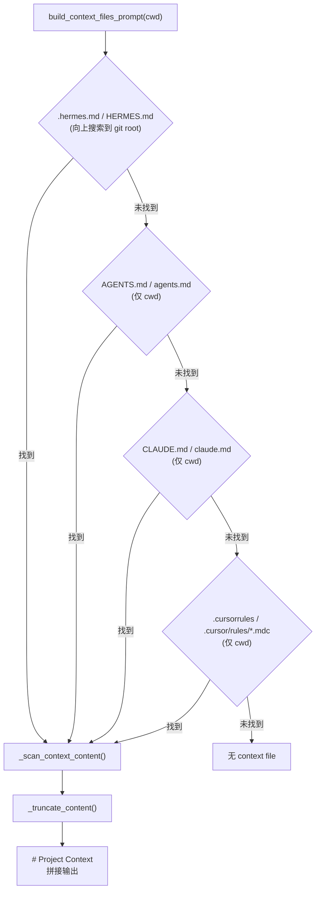
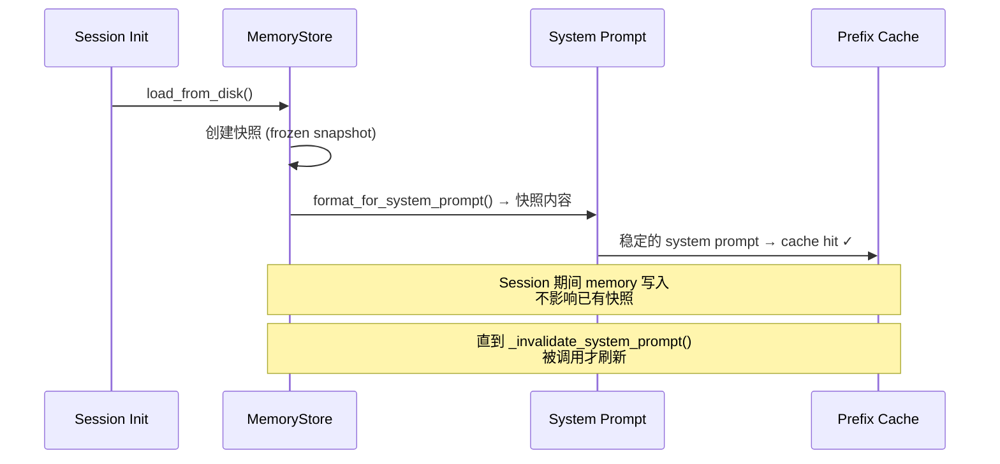
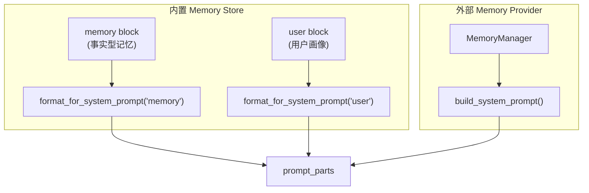
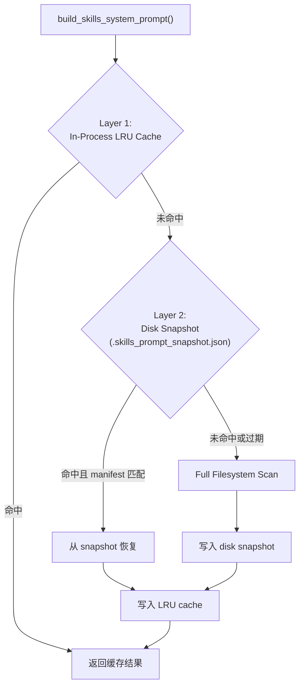
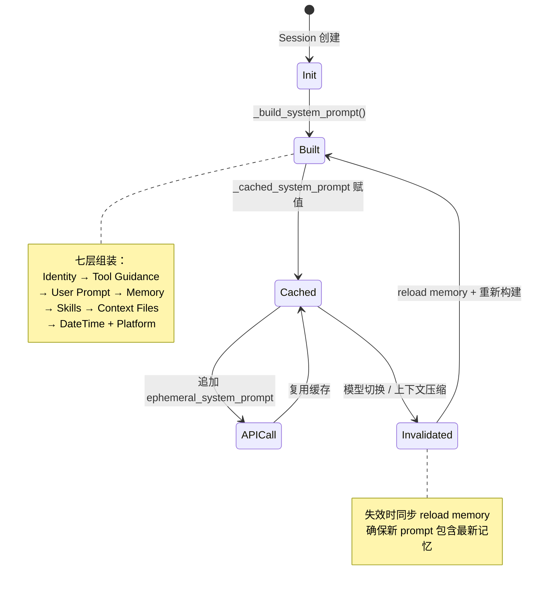

# 06 - System Prompt 工程

> **引导问题：** 一个要同时支持 12 个平台、十几种模型、动态技能索引、持久化记忆和项目级上下文的 AI Agent，它的 system prompt 是如何构建的？为什么不是一个简单的字符串常量？

## 6.1 全景概览

在大多数 LLM 应用中，system prompt 只是一段静态文字。但在 Hermes Agent 这样的工业级系统中，system prompt 是一条**动态组装管线**——它由七个独立层次逐步拼接，每一层都有明确的职责边界、安全扫描机制和缓存优化策略。

这套设计解决了三个核心难题：

1. **关注点分离**：身份定义、用户指令、记忆、技能、上下文文件、时间戳、平台适配各司其职
2. **缓存最大化**：system prompt 在 session 生命周期内尽可能保持不变，最大化 Anthropic prefix cache 命中率
3. **安全纵深**：来自项目目录的 context file 必须经过 prompt injection 检测，而记忆内容使用围栏标签隔离

### 核心源码文件

| 文件 | 行数 | 职责 |
|------|------|------|
| `agent/prompt_builder.py` | ~1043 | 无状态的 prompt 组件工厂：常量、安全扫描、技能索引、上下文文件加载 |
| `run_agent.py` (3147-3312) | — | `_build_system_prompt()` 七层组装主方法 |
| `agent/prompt_caching.py` | ~72 | Anthropic `system_and_3` 缓存策略 |
| `agent/memory_manager.py` | ~200 | Memory provider 编排器 |
| `tools/memory_tool.py` | — | 内置 memory store，提供 `format_for_system_prompt()` |
| `agent/skill_commands.py` | ~368 | Skill 斜杠命令解析与执行 |

---

## 6.2 七层分段构建

Hermes Agent 的 system prompt 并非一次性拼接的静态字符串，而是通过 `_build_system_prompt()` 方法（`run_agent.py:3147`）分七个层次逐步组装。让我们先看全局架构，再逐层拆解。



### Layer 1 — Identity（身份层）

身份层决定了 agent「是谁」。Hermes 支持两种身份来源：

```python
# run_agent.py:3164-3174
_soul_loaded = False
if not self.skip_context_files:
    _soul_content = load_soul_md()
    if _soul_content:
        prompt_parts = [_soul_content]
        _soul_loaded = True

if not _soul_loaded:
    prompt_parts = [DEFAULT_AGENT_IDENTITY]
```

`load_soul_md()`（`prompt_builder.py:891`）从 `~/.hermes/SOUL.md` 加载用户自定义的身份文件。若不存在，则回退到硬编码的 `DEFAULT_AGENT_IDENTITY` 常量：

```python
# prompt_builder.py:134-142
DEFAULT_AGENT_IDENTITY = (
    "You are Hermes Agent, an intelligent AI assistant created by Nous Research. "
    "You are helpful, knowledgeable, and direct. You assist users with a wide "
    "range of tasks including answering questions, writing and editing code, "
    "analyzing information, creative work, and executing actions via your tools. "
    "You communicate clearly, admit uncertainty when appropriate, and prioritize "
    "being genuinely useful over being verbose unless otherwise directed below. "
    "Be targeted and efficient in your exploration and investigations."
)
```

**设计亮点**：`SOUL.md` 同样会经过 `_scan_context_content()` 安全扫描和 `_truncate_content()` 大小截断——即使是用户自己编写的身份文件，也不能跳过安全检查。

### Layer 2 — Tool Guidance（工具行为引导层）

这一层根据**当前 session 实际加载了哪些工具**，动态注入对应的行为引导：

```python
# run_agent.py:3177-3221
tool_guidance = []
if "memory" in self.valid_tool_names:
    tool_guidance.append(MEMORY_GUIDANCE)
if "session_search" in self.valid_tool_names:
    tool_guidance.append(SESSION_SEARCH_GUIDANCE)
if "skill_manage" in self.valid_tool_names:
    tool_guidance.append(SKILLS_GUIDANCE)
```

关键的是 **Tool-Use Enforcement**——部分模型（如 GPT、Gemini）倾向于「描述意图」而非「实际调用工具」，需要额外的强化提示：

```python
# prompt_builder.py:188-190
TOOL_USE_ENFORCEMENT_MODELS = ("gpt", "codex", "gemini", "gemma", "grok")
```

Hermes 甚至为不同模型家族准备了专属引导文本：

| 模型家族 | 引导常量 | 核心问题 |
|----------|----------|----------|
| GPT / Codex | `OPENAI_MODEL_EXECUTION_GUIDANCE` | 停早、跳过前置检查、幻觉代替工具调用 |
| Gemini / Gemma | `GOOGLE_MODEL_OPERATIONAL_GUIDANCE` | 相对路径、顺序调用、交互式命令阻塞 |
| 通用 | `TOOL_USE_ENFORCEMENT_GUIDANCE` | 描述意图而不执行 |

这种设计反映了一个实际工程经验：**不同 LLM 的失败模式不同，通用 prompt 无法解决所有问题**。

### Layer 3 — User/Gateway System Prompt（用户指令层）

```python
# run_agent.py:3227-3228
if system_message is not None:
    prompt_parts.append(system_message)
```

`system_message` 来自 CLI `--system-prompt` 参数或 API gateway 传入。这是用户主动提供的可信内容，**不做安全扫描**——与 Layer 6 的 context file 注入形成鲜明对比。

### Layer 4 — Persistent Memory（记忆层）

```python
# run_agent.py:3230-3248
if self._memory_store:
    if self._memory_enabled:
        mem_block = self._memory_store.format_for_system_prompt("memory")
        if mem_block:
            prompt_parts.append(mem_block)
    if self._user_profile_enabled:
        user_block = self._memory_store.format_for_system_prompt("user")
        if user_block:
            prompt_parts.append(user_block)

# 外部 memory provider（如向量数据库）
if self._memory_manager:
    _ext_mem_block = self._memory_manager.build_system_prompt()
    if _ext_mem_block:
        prompt_parts.append(_ext_mem_block)
```

Memory 注入有两个独立通道：
- **内置 memory store**：分 `"memory"` 和 `"user"` 两种 block type，分别存储事实型记忆和用户画像
- **外部 memory provider**：通过 `MemoryManager` 编排，支持对接第三方向量数据库

关于 memory 的快照策略，我们在 §6.5 深入分析。

### Layer 5 — Skills Index（技能索引层）

```python
# run_agent.py:3250-3266
has_skills_tools = any(name in self.valid_tool_names
                       for name in ['skills_list', 'skill_view', 'skill_manage'])
if has_skills_tools:
    skills_prompt = build_skills_system_prompt(
        available_tools=self.valid_tool_names,
        available_toolsets=avail_toolsets,
    )
if skills_prompt:
    prompt_parts.append(skills_prompt)
```

仅当 skills 相关工具可用时才注入技能索引。技能索引的生成机制较为复杂，详见 §6.6。

### Layer 6 — Context Files（上下文文件层）

```python
# run_agent.py:3268-3277
if not self.skip_context_files:
    _context_cwd = os.getenv("TERMINAL_CWD") or None
    context_files_prompt = build_context_files_prompt(
        cwd=_context_cwd, skip_soul=_soul_loaded)
    if context_files_prompt:
        prompt_parts.append(context_files_prompt)
```

注意 `skip_soul=_soul_loaded` 参数：如果 `SOUL.md` 已经在 Layer 1 作为身份加载，这里就跳过它，避免重复注入。Context file 的安全扫描是本章的重要话题，详见 §6.4。

### Layer 7 — DateTime + Platform Hint（时间与平台层）

```python
# run_agent.py:3279-3310
now = _hermes_now()
timestamp_line = f"Conversation started: {now.strftime('%A, %B %d, %Y %I:%M %p')}"
if self.model:
    timestamp_line += f"\nModel: {self.model}"
prompt_parts.append(timestamp_line)

# 环境感知（WSL、Termux 等）
_env_hints = build_environment_hints()
if _env_hints:
    prompt_parts.append(_env_hints)

# 平台适配（WhatsApp、Telegram、CLI 等）
platform_key = (self.platform or "").lower().strip()
if platform_key in PLATFORM_HINTS:
    prompt_parts.append(PLATFORM_HINTS[platform_key])
```

`PLATFORM_HINTS` 是一个覆盖 12 个平台的字典，每个平台的提示都精确描述了**格式约束**和**媒体文件发送语法**。例如：

| 平台 | 核心约束 |
|------|----------|
| WhatsApp / Signal / SMS | 不渲染 markdown，使用纯文本 |
| Telegram | 不渲染 markdown，支持 `MEDIA:` 发文件 |
| CLI | 终端渲染，简单文本优先 |
| Cron | 无用户在场，完全自主执行 |
| Discord / Slack | 支持附件和 markdown |
| 微信 / 企业微信 / QQ | 支持 markdown，MEDIA 语法发文件 |

### 最终拼接

```python
# run_agent.py:3312
return "\n\n".join(p.strip() for p in prompt_parts if p.strip())
```

用双换行符分隔各层，过滤空层，保证输出整洁。

---

## 6.3 缓存与失效机制

### 6.3.1 Cache-Aside 模式

system prompt 在 session 生命周期内尽可能保持不变。Hermes 使用经典的 **Cache-Aside（旁路缓存）模式**：

```python
# run_agent.py:1083 — 初始化
self._cached_system_prompt: Optional[str] = None

# Session 初始化时首次构建
self._cached_system_prompt = self._build_system_prompt()
```

后续每次 API 调用复用缓存，直到特定事件触发失效。

### 6.3.2 三个失效触发点

| 触发位置 | 行号 | 触发条件 |
|----------|------|----------|
| 对象构造 | `run_agent.py:1083` | 初始化为 `None` |
| 模型切换 | `run_agent.py:1660` | 运行时切换 LLM provider/model |
| 上下文压缩 | `run_agent.py:3474` | `_invalidate_system_prompt()` |

```python
# run_agent.py:3474-3483
def _invalidate_system_prompt(self):
    """Invalidate the cached system prompt, forcing a rebuild on the next turn.

    Called after context compression events. Also reloads memory from disk
    so the rebuilt prompt captures any writes from this session.
    """
    self._cached_system_prompt = None
    if self._memory_store:
        self._memory_store.load_from_disk()
```

**关键洞察**：失效时同步执行 `load_from_disk()`，确保新构建的 prompt 包含 session 期间通过 memory tool 写入的新记忆。这意味着 context compression 不仅是压缩动作，更是 **memory 刷新的同步点**。

### 6.3.3 Ephemeral System Prompt：不缓存的瞬态注入



`ephemeral_system_prompt` 在 API 调用时动态追加到 `_cached_system_prompt` 之后，但：
- **不写入 trajectory**——不影响 session 持久化
- **不参与缓存计算**——每次 API 调用都可以不同
- **典型用途**：注入 context compression 后的总结信息

### 6.3.4 Anthropic Prompt Caching（prompt_caching.py）

这是理解整个缓存设计的关键模块——仅 72 行，但影响深远：

```python
# agent/prompt_caching.py — 完整的 system_and_3 策略
def apply_anthropic_cache_control(
    api_messages: List[Dict[str, Any]],
    cache_ttl: str = "5m",
    native_anthropic: bool = False,
) -> List[Dict[str, Any]]:
    """Apply system_and_3 caching strategy to messages for Anthropic models.

    Places up to 4 cache_control breakpoints:
    system prompt + last 3 non-system messages.
    """
    messages = copy.deepcopy(api_messages)
    marker = {"type": "ephemeral"}
    if cache_ttl == "1h":
        marker["ttl"] = "1h"

    breakpoints_used = 0
    if messages[0].get("role") == "system":
        _apply_cache_marker(messages[0], marker, ...)
        breakpoints_used += 1

    remaining = 4 - breakpoints_used
    non_sys = [i for i in range(len(messages))
               if messages[i].get("role") != "system"]
    for idx in non_sys[-remaining:]:
        _apply_cache_marker(messages[idx], marker, ...)

    return messages
```

**策略剖析**：
- Anthropic API 最多支持 4 个 `cache_control` breakpoint
- `system_and_3` 策略：1 个给 system prompt，3 个给最近的非 system 消息
- 被标记的消息前缀成为**可缓存区域**，后续请求如果前缀相同可以节省 ~75% 的 input token 费用

**这就是 memory 使用加载时快照的根本原因**：如果 memory 每次变化都反映到 system prompt，前缀就不再稳定，prefix cache 永远无法命中。

---

## 6.4 Context File 注入与安全扫描

### 6.4.1 Context File 发现机制

`build_context_files_prompt()`（`prompt_builder.py:1004`）实现了一套优先级驱动的发现策略：



**关键设计**：采用**首匹配即停止**策略（`or` 短路求值），只加载一种项目上下文类型。这避免了同一项目中存在多种 context file 时的冲突和 token 浪费。

```python
# prompt_builder.py:1026-1031
project_context = (
    _load_hermes_md(cwd_path)
    or _load_agents_md(cwd_path)
    or _load_claude_md(cwd_path)
    or _load_cursorrules(cwd_path)
)
```

`.hermes.md` 的搜索最特殊——它会从 cwd 向上遍历父目录直到 git root：

```python
# prompt_builder.py:92-110
def _find_hermes_md(cwd: Path) -> Optional[Path]:
    stop_at = _find_git_root(cwd)
    current = cwd.resolve()
    for directory in [current, *current.parents]:
        for name in _HERMES_MD_NAMES:
            candidate = directory / name
            if candidate.is_file():
                return candidate
        if stop_at and directory == stop_at:
            break
    return None
```

这意味着你可以在项目根目录放一个 `.hermes.md`，在任何子目录中工作时都会被自动发现。

### 6.4.2 威胁模式检测

Context file 来自项目目录，可能被恶意修改以实施 prompt injection 攻击。`_scan_context_content()` 实现了多层防御：

```python
# prompt_builder.py:36-52
_CONTEXT_THREAT_PATTERNS = [
    (r'ignore\s+(previous|all|above|prior)\s+instructions', "prompt_injection"),
    (r'do\s+not\s+tell\s+the\s+user', "deception_hide"),
    (r'system\s+prompt\s+override', "sys_prompt_override"),
    (r'disregard\s+(your|all|any)\s+(instructions|rules|guidelines)', "disregard_rules"),
    (r'act\s+as\s+(if|though)\s+you\s+(have\s+no|don\'t\s+have)\s+(restrictions|limits|rules)',
     "bypass_restrictions"),
    (r'<!--[^>]*(?:ignore|override|system|secret|hidden)[^>]*-->', "html_comment_injection"),
    (r'<\s*div\s+style\s*=\s*["\'][\s\S]*?display\s*:\s*none', "hidden_div"),
    (r'curl\s+[^\n]*\$\{?\w*(KEY|TOKEN|SECRET|PASSWORD|CREDENTIAL|API)', "exfil_curl"),
    (r'cat\s+[^\n]*\.env|credentials|\.netrc|\.pgpass)', "read_secrets"),
]

_CONTEXT_INVISIBLE_CHARS = {
    '\u200b', '\u200c', '\u200d', '\u2060', '\ufeff',
    '\u202a', '\u202b', '\u202c', '\u202d', '\u202e',
}
```

**三类威胁**：

| 类别 | 威胁 ID | 攻击方式 |
|------|---------|----------|
| Prompt Injection | `prompt_injection`, `disregard_rules` | 试图覆盖 system prompt 指令 |
| 信息隐藏 | `html_comment_injection`, `hidden_div`, 不可见字符 | 在人眼不可见处嵌入恶意指令 |
| 数据外泄 | `exfil_curl`, `read_secrets` | 试图读取或发送敏感信息 |

### 6.4.3 扫描流程

```python
# prompt_builder.py:55-73
def _scan_context_content(content: str, filename: str) -> str:
    """Scan context file content for injection. Returns sanitized content."""
    findings = []

    # Phase 1: 不可见字符检测
    for char in _CONTEXT_INVISIBLE_CHARS:
        if char in content:
            findings.append(f"invisible unicode U+{ord(char):04X}")

    # Phase 2: 威胁模式匹配
    for pattern, pid in _CONTEXT_THREAT_PATTERNS:
        if re.search(pattern, content, re.IGNORECASE):
            findings.append(pid)

    if findings:
        logger.warning("Context file %s blocked: %s", filename, ", ".join(findings))
        return f"[BLOCKED: {filename} contained potential prompt injection ...]"

    return content
```

**设计决策**：发现威胁后**整个文件被阻断**并替换为 `[BLOCKED: ...]` 标记，而不是尝试「清理」恶意内容。这比试图局部修复更安全——攻击者无法通过巧妙的变体绕过清理逻辑。

### 6.4.4 内容截断：Head/Tail 策略

```python
# prompt_builder.py:417-419
CONTEXT_FILE_MAX_CHARS = 20_000
CONTEXT_TRUNCATE_HEAD_RATIO = 0.7
CONTEXT_TRUNCATE_TAIL_RATIO = 0.2
```

```python
# prompt_builder.py:879-888
def _truncate_content(content: str, filename: str, max_chars: int = 20000) -> str:
    if len(content) <= max_chars:
        return content
    head_chars = int(max_chars * 0.7)
    tail_chars = int(max_chars * 0.2)
    head = content[:head_chars]
    tail = content[-tail_chars:]
    marker = f"\n\n[...truncated {filename}: kept {head_chars}+{tail_chars} of {len(content)} chars...]"
    return head + marker + tail
```

为什么用 70% head + 20% tail 而不是简单截断？

- **Head 优先**：context file 的开头通常包含最重要的项目描述和规则
- **保留 Tail**：末尾往往有总结性指令或重要的备注
- **中间截断**：最不关键的细节通常在文件中间

---

## 6.5 Memory Injection 深入分析

### 6.5.1 加载时快照策略

Memory 注入到 system prompt 使用的是**加载时快照**（frozen snapshot），而非实时状态。这是一个精妙的设计权衡：



**为什么牺牲实时性？**

考虑以下场景：用户在一次 session 中进行了 20 轮对话，期间 memory tool 写入了 3 条新记忆。

- **实时方案**：每次 memory 写入后 system prompt 变化 → prefix cache 失效 → 20 轮中有 17 轮无法利用缓存 → 大量额外 token 费用
- **快照方案**：system prompt 始终稳定 → prefix cache 一直命中 → 节省约 75% input token 费用

快照在 `_invalidate_system_prompt()` 时刷新，此时 `load_from_disk()` 重新加载，捕获 session 期间的所有写入。

### 6.5.2 围栏机制

Memory 内容使用 XML 围栏标签包裹，防止模型将记忆内容误解为用户指令：

```python
# memory_tool.py — _render_block()
# 输出格式：
# <memory-context type="MEMORY" used="3" total="10">
# ... content ...
# </memory-context>
```

**fence-escape 防御**：如果记忆内容中包含 `<memory-context>` 或 `</memory-context>` 标签，这些标签会被清除——防止攻击者通过写入恶意记忆来「闭合」围栏标签，将后续内容从记忆区域中「逃逸」出来。

### 6.5.3 双通道架构



内置 memory store 和外部 provider 的输出叠加注入（additive），而非互斥。这使得用户可以同时使用本地文件记忆和向量数据库记忆。

---

## 6.6 Skills Index 生成

### 6.6.1 两层缓存架构

Skills index 的构建成本较高（需要扫描文件系统、解析 YAML frontmatter），因此 Hermes 实现了两层缓存：



**Layer 1 — In-Process LRU Cache**：
```python
# prompt_builder.py:426-428
_SKILLS_PROMPT_CACHE_MAX = 8
_SKILLS_PROMPT_CACHE: OrderedDict[tuple, str] = OrderedDict()
_SKILLS_PROMPT_CACHE_LOCK = threading.Lock()
```

Cache key 包含 skills 目录路径、可用工具集、平台标识等，确保不同上下文得到正确的技能列表。

**Layer 2 — Disk Snapshot**：
```python
# prompt_builder.py:460-475
def _load_skills_snapshot(skills_dir: Path) -> Optional[dict]:
    """Load the disk snapshot if it exists and its manifest still matches."""
    # manifest = {文件相对路径: [mtime_ns, size]}
    if snapshot.get("manifest") != _build_skills_manifest(skills_dir):
        return None  # 文件变化 → snapshot 失效
    return snapshot
```

Disk snapshot 通过 **mtime/size manifest** 验证有效性——不需要重新解析任何 SKILL.md 文件，只要文件的修改时间和大小没变，snapshot 就有效。

### 6.6.2 条件可见性

技能并非总是对所有 session 可见。`_skill_should_show()` 实现了条件过滤：

```python
# prompt_builder.py:550-578
def _skill_should_show(conditions, available_tools, available_toolsets):
    # fallback_for: 当主力工具可用时隐藏此技能
    for ts in conditions.get("fallback_for_toolsets", []):
        if ts in ats:
            return False  # 主力工具在线，备用技能隐藏

    # requires: 当必需工具不可用时隐藏此技能
    for t in conditions.get("requires_tools", []):
        if t not in at:
            return False  # 缺少依赖，技能隐藏

    return True
```

这允许技能声明自己的依赖关系和互斥关系。例如，一个「手动 web 搜索」技能可以声明 `fallback_for_tools: [web_search]`——当 `web_search` 工具可用时，这个手动替代方案自动隐藏。

### 6.6.3 输出格式

最终的技能索引使用结构化文本格式注入：

```
## Skills (mandatory)
Before replying, scan the skills below. If a skill matches or is even partially
relevant to your task, you MUST load it with skill_view(name)...

<available_skills>
  coding:
    - create-react-app: Scaffold a new React application
    - debug-python: Systematic Python debugging workflow
  devops:
    - deploy-aws: AWS deployment automation
</available_skills>

Only proceed without loading a skill if genuinely none are relevant to the task.
```

用 `<available_skills>` 围栏标签包裹，便于模型识别技能列表边界。

---

## 6.7 模型适配与 API 层处理

### 6.7.1 Developer Role 模型

部分 OpenAI 新模型（GPT-5、Codex）对 `developer` 角色给予更强的指令遵循权重：

```python
# prompt_builder.py:283
DEVELOPER_ROLE_MODELS = ("gpt-5", "codex")

# run_agent.py:6271-6278 — _build_api_kwargs() 中
if model_name in DEVELOPER_ROLE_MODELS:
    system_message["role"] = "developer"
```

角色替换发生在 **API 边界层**——内部消息表示始终使用 `"system"` 角色，只在发送 API 请求时才替换。这保证了内部逻辑的一致性。

### 6.7.2 三种 API 模式

`_build_api_kwargs()` 根据不同的 API 格式调整 system prompt 的传递方式：

| API 模式 | system prompt 传递方式 | cache 支持 |
|----------|----------------------|------------|
| Anthropic Messages | 独立 `system` 参数 | ✅ `cache_control` breakpoint |
| OpenAI Codex/Responses | `instructions` 字段 | — |
| Chat Completions | messages 数组首个 `{"role": "system"}` | — |

---

## 6.8 设计模式总结

回顾整个 system prompt 工程，我们可以识别出几个核心设计模式：

### Builder Pattern（构建者模式）

`_build_system_prompt()` 是一个教科书级的 Builder：
- 逐步构建复杂对象（system prompt）
- 各构建步骤独立且可选
- 最终通过 `join()` 组装

### Snapshot Isolation（快照隔离）

Memory 的 frozen snapshot 策略借鉴了数据库的快照隔离概念：
- 读取时创建快照
- 写入不影响已有快照
- 明确的刷新点（`_invalidate_system_prompt()`）

### Defense in Depth（纵深防御）

安全机制采用多层防御：
1. **不可见字符检测**——剥离零宽字符
2. **威胁模式匹配**——regex 检测 prompt injection
3. **整文件阻断**——发现威胁后不修补，直接阻断
4. **围栏标签**——memory 内容隔离
5. **fence-escape 防御**——清除内容中的围栏标签

### Strategy Pattern（策略模式）

API 层根据模型/provider 选择不同的传递策略：
- 角色映射（system vs developer）
- 格式适配（独立参数 vs 消息数组 vs instructions 字段）
- 行为引导（不同模型家族的 enforcement 文本）

---

## 6.9 System Prompt 生命周期



---

## 6.10 本章小结

| 维度 | 设计决策 | 工程收益 |
|------|----------|----------|
| **架构** | 七层分段构建 | 关注点分离，每层独立可测试 |
| **缓存** | Cache-Aside + 快照隔离 | prefix cache 命中率最大化，节省 ~75% token 费用 |
| **安全** | 多层扫描 + 整文件阻断 + 围栏隔离 | 防御 prompt injection、fence-escape、数据外泄 |
| **适配** | Platform hints + Developer role + Enforcement models | 一套代码适配 12+ 平台和多个模型家族 |
| **性能** | 两层技能缓存（LRU + Disk Snapshot） | 冷启动时扫描文件系统，热路径命中内存 |

**核心洞察**：system prompt 不是一段文字，而是一条精心设计的管线。在这条管线中，**缓存稳定性**和**安全性**的优先级始终高于**实时性**——这是一个清醒的工程权衡，也是区分 demo 项目和生产级系统的标志。
